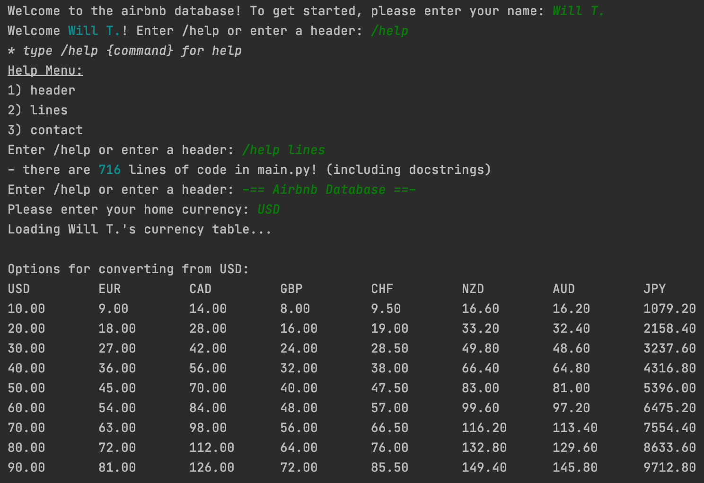

<!-- Project Reference Links -->
[![Contributors][contributors-shield]][contributors-url]
[![LinkedIn][linkedin-shield]][linkedin-url]

<!--Project Header -->
<h1 align="center">NY-Rent-Data</h1>
<h3 align="center">Load, display, & interact with lightweight airbnb data.</h3>

<h4 align="center">
    <a href="#overview">Overview</a> -
    <a href="#setup">Setup</a> -
    <a href="#changelog">Changelog</a> -
    <a href="#acknowledgements">Acknowledgements</a>
</h4>
  
<!-- Overview -->
## Overview
<p align="center">
    <a href="https://github.com/willtholke/NY-rent-data">
        
    <a/>
<p>

This project displays airbnb data from a .csv file in a way that allows user to interact with said data.

<!-- Setup -->
## Setup
To get a local copy up and running, follow these steps

### Installation
1. Clone the repo
    ```sh
    git clone https://github.com/willtholke/NY-rent-data.git
    ```
    
### Install requirements.txt
1. Navigate to the directory where requirements.txt is located using Command Prompt (Windows) or Terminal (Mac)
2. Automatically install the libraries used in this project
    ```sh
    pip install -r requirements.txt
    ```

## Changelog
### Recent Changes
* The new global string object called 'filename' (which refers to the new airbnb data source, 'AB_NYC_2019.csv') is utilized in load_file(), the new method in the DataSet class that loads data from filename.
* Added InvalidDataLength class to the DataSet class (lines 96, 97) as a logical error to be raised (lines 178-180) if the length of the file referred to by 'filename' is not 48895.
* Set global variable line_count equal to len(self.data) to avoid "Expected type 'Sized', got 'None' instead" error that occurred when attempting to print len(self.data) on line 477. The value of line_count is manipulated twice in the program, which does not affect the output in any unintended way.


## Acknowledgements
* [Professor Eric Reed](https://www.linkedin.com/in/eric-reed-a18b82a1)


[linkedin-shield]: https://img.shields.io/badge/-LinkedIn-black.svg?style=for-the-badge&logo=linkedin&colorB=555
[linkedin-url]: https://linkedin.com/in/williametholke
[contributors-shield]: https://img.shields.io/github/contributors/willtholke/NY-rent-data.svg?style=for-the-badge
[contributors-url]: https://github.com/willtholke/NY-rent-data/contributors
